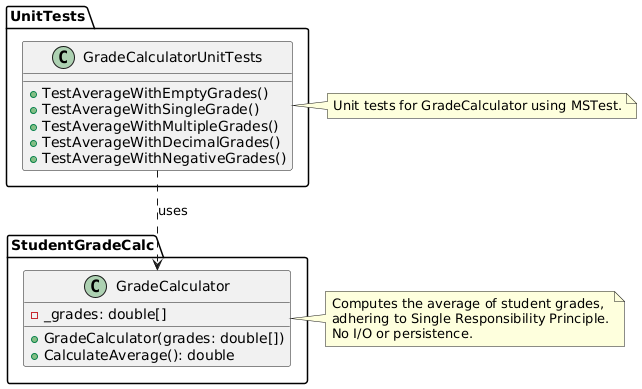

# Student Grade Calculator

A simple .NET library that calculates student grade averages, demonstrating the Single Responsibility Principle (SRP) of SOLID design principles.

## Overview

This project provides a grade calculator that can compute the average of a set of student grades. It is built using .NET 8.0 and follows clean code practices and modern C# conventions.

## Project Structure

```
├── StudentGradeCalc/         # Main library project
│   ├── GradeCalculator.cs    # Core grade calculation logic
│   └── StudentGradeCalc.csproj
├── UnitTests/               # Test project
│   ├── GradeCalculatorUnitTests.cs
│   └── UnitTests.csproj
├── SoftwareDesignPatterns.sln
└── Readme.md
```

## UML Diagram


## Features

- Calculate average grades for a set of student scores
- Handles empty grade sets gracefully (returns 0)
- Supports decimal grade values
- No grade validation (accepts any numerical value)

## Usage

```csharp
// Create a calculator instance with grades
var grades = new double[] { 80.5, 90.5, 100 };
var calculator = new GradeCalculator(grades);

// Calculate the average
double average = calculator.CalculateAverage();
```

### Building

```sh
dotnet build
```

### Running Tests

```sh
dotnet test
```

## Design Principles

This project demonstrates:
- Single Responsibility Principle (SRP)
- Clean Code practices
- Unit testing best practices
- XML documentation

## Contributing

Please review the `.editorconfig` file for coding style guidelines before contributing.

